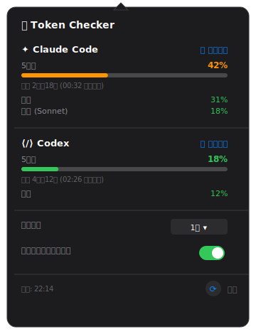

# Token Checker

macOS のメニューバーに Claude Code と Codex の使用率を常時表示する macOS アプリケーション。

<p align="center">
  
</p>

## 概要

ターミナルで `claude login` / `codex login` を完了済みのアカウントに対し、Anthropic の OAuth エンドポイントおよび `codex app-server` の JSON-RPC を経由してレート制限情報を取得する。取得結果はメニューバーに 2 個のドーナツチャートと数値で表示され、クリックでポップオーバーに 5 時間ウィンドウと週次ウィンドウの詳細を展開する。

## 動作要件

| 項目 | 値 |
| --- | --- |
| macOS | 14 Sonoma 以上 |
| Swift | 5.9 以上（Xcode Command Line Tools で可） |
| Claude Code CLI | `claude login` 済み |
| Codex CLI | `codex login` 済み |

Claude Code と Codex のいずれかが欠けていても、もう一方は動作する。

## インストール

このリポジトリを clone した上で、自分のマシンでビルドして使うことを前提とする。

```bash
./Scripts/build.sh --install
```

ビルド時に Apple Development の署名 identity が見つからない場合は ad-hoc 署名が自動的に使われる。自分でビルドした `.app` はそのまま起動できる。

インストール後は Finder の「アプリケーション」から `TokenChecker` を開くか、ターミナルから以下を実行して起動する。

```bash
open /Applications/TokenChecker.app
```


## 使用方法

事前にターミナルで以下を実行し、両サービスにログインしておく。

```bash
claude login
codex login
```

いずれもブラウザの OAuth フローを経て、Keychain または `~/.codex/auth.json` にトークンが保存される。アプリは保存されたトークンを参照するため、ログインは CLI 側で 1 度行えばよい。


<p align="center">
  
</p>

クリックで展開するポップオーバーには、5 時間ウィンドウと週次ウィンドウの使用率、リセットまでの残時間、更新間隔（30 秒〜10 分、既定 5 分）、ログイン時の自動起動トグルが含まれる。

## データ取得経路

- **Claude**: `/usr/bin/security` 経由で Keychain (`Claude Code-credentials`) から OAuth アクセストークンを取得し、`https://api.anthropic.com/api/oauth/usage` に対して `anthropic-beta: oauth-2025-04-20` ヘッダー付きで GET する。
- **Codex**: `/opt/homebrew/bin/codex app-server` を子プロセスとして起動し、行区切り JSON-RPC 経由で `account/rateLimits/read` を呼ぶ。


## アンインストール

```bash
killall TokenChecker
defaults delete com.token-checker.app 2>/dev/null
```

## ライセンス

本ソフトウェアは [MIT License](./LICENSE) で配布される。
なお「Anthropic」「Claude」「Codex」は各社の商標であり、本ソフトウェアは Anthropic および OpenAI の公式プロダクトではなく、両社による承認・推奨を受けたものでもない。

## 免責事項

本ソフトウェアは現状有姿 (as-is) で提供されるものであり、動作・安全性・正確性について一切の保証を行わない。本ソフトウェアの利用に起因して発生したいかなる損害 (データ損失、アカウント停止、トークン漏洩、セキュリティインシデント等を含むがこれに限らない) についても、作者は一切の責任を負わない。利用者自身の責任において使用すること。

## 謝辞

UI のデザインは [s-age/ccmeter](https://github.com/s-age/ccmeter)（MIT License）を参考にした。MIT ライセンスは [`LICENSE`](./LICENSE) に同梱している。
