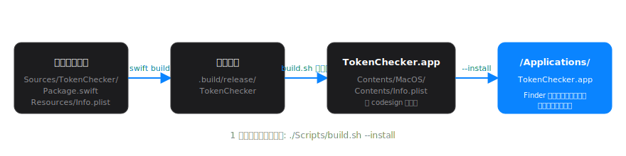
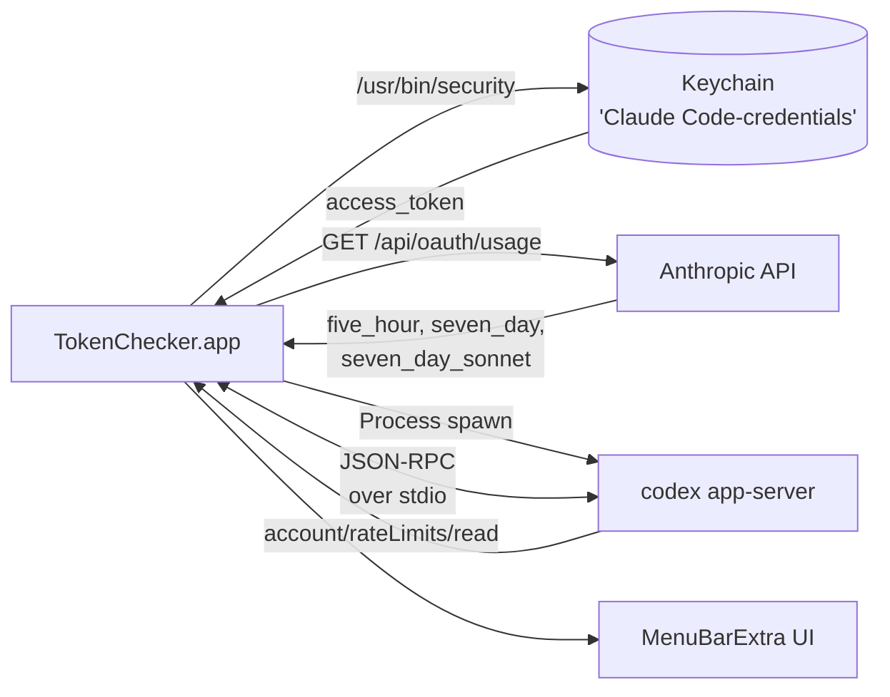

# Token Checker

macOS のメニューバーに **Claude Code** と **Codex** の使用率を常時表示する個人向け macOS アプリ。

<p align="center">
  
</p>

- ✅ Claude Code と Codex の **5 時間ウィンドウ** 使用率を一目で
- ✅ クリックで詳細ポップオーバー（リセット時刻、週次使用率も）
- ✅ ネイティブ Swift / SwiftUI 製、常駐メモリ **数十 MB**、idle CPU **0 %**
- ✅ Anthropic / OpenAI の API キー不要（既存の `claude login` / `codex login` を間借り）
- ✅ App Store 配布ではない個人ツール。`/Applications` に置いて普通に使う

---

## 目次

- [できること](#できること)
- [動作要件](#動作要件)
- [ビルドとインストール](#ビルドとインストール)
- [使い方](#使い方)
- [仕組み](#仕組み)
- [トラブルシューティング](#トラブルシューティング)
- [プライバシー](#プライバシー)
- [謝辞 / ライセンス](#謝辞--ライセンス)

---

## できること

### メニューバー本体

メニューバーには **2 つのドーナツ + %** が常に表示されます。

| 表示 | 意味 |
| --- | --- |
| 左のドーナツ + % | **Claude Code** の 5 時間ウィンドウ使用率 |
| 右のドーナツ + % | **Codex** の 5 時間ウィンドウ使用率 |
| 色 | 緑 (<50%) → 橙 (50-75%) → 赤 (>75%) |

### ポップオーバー（クリック時）

<p align="center">
  
</p>

- 各サービスの **5 時間ウィンドウ** 使用率（プログレスバー + リセットまでの残り時間）
- **週次** ウィンドウ使用率（補助情報、Claude は Sonnet 専用枠も）
- 「Claude にログイン」「Codex にログイン」ボタン（必要な時だけ使う）
- 更新間隔の変更（30 秒 〜 10 分）
- ログイン時の自動起動トグル

---

## 動作要件

| 要件 | 内容 |
| --- | --- |
| macOS | **14 Sonoma 以上** |
| Mac | Apple Silicon を想定（Intel でも動くはず） |
| Swift | 5.9 以上（Xcode Command Line Tools か Xcode） |
| Claude Code CLI | `claude` コマンドが `claude login` 済みであること |
| Codex CLI | `/opt/homebrew/bin/codex` 等で `codex login` 済みであること |

> Codex CLI が未インストールでも Claude 側は動きます。逆も同様。

---

## ビルドとインストール

<p align="center">
  
</p>

### 1. リポジトリへ移動

```bash
cd ~/Documents/program/token-checker
```

### 2. ビルド + `/Applications` への配置（1 コマンド）

```bash
./Scripts/build.sh --install
```

これだけで以下が走ります：

1. `swift build -c release` — Swift のリリースビルド
2. `.app` バンドル組立（`Contents/MacOS/` `Contents/Info.plist`）
3. `codesign` で署名（自動的に ad-hoc か Developer ID を選択）
4. `/Applications/TokenChecker.app` にコピー

> 自分の `~/Applications/` に入れたい場合は `--install` の代わりに `--user-install`。

### 3. 起動

Finder で **アプリケーション → TokenChecker.app** をダブルクリック。

> **初回起動の注意**: ad-hoc 署名なので Gatekeeper が「開発元を確認できません」と出します。
> その場合は `/Applications` 内の TokenChecker.app を **右クリック → 開く → 開く** で 1 回だけ通してください。次回からは普通にダブルクリックで起動できます。

### 4. ログイン時の自動起動

メニューバーアイコンをクリック → 「ログイン時に自動起動」をオンにすると、Mac 起動時に自動で常駐するようになります。

---

## 使い方

### 前提: CLI でログイン

このアプリは **アプリ内ログイン UI を持ちません**。代わりに、すでにターミナルでログイン済みの Claude Code / Codex の認証情報を借りて使います。

まだログインしていなければ、ターミナルで：

```bash
claude login    # Claude Code (Anthropic) でログイン
codex login     # Codex (OpenAI) でログイン
```

ブラウザが開いて OAuth フローが走ります。完了するとそれぞれ Keychain / `~/.codex/auth.json` にトークンが保存されます。

ポップオーバー内の「ログイン」ボタンは、上の `claude login` / `codex login` を **新しいターミナルで実行する shortcut** です。日常的には使わなくて OK。

### 普段の使い方

- メニューバーで何 % か眺める（更新は自動）
- 詳細を見たいときはクリックでポップオーバーを開く
- 終了したいときはポップオーバーの「終了」を押す

### 更新間隔について

デフォルト 1 分。30 秒に上げても通信は **Claude 側の API 呼び出し 1 回 / 30 秒、Codex 側は完全にローカル IPC のみ** なので、ネットワーク負荷もバッテリ消費も無視できる範囲です。

---

## 仕組み

### データ取得



- **Claude**: macOS Keychain (`Claude Code-credentials`) から OAuth トークンを `security` コマンド経由で読み取り、`https://api.anthropic.com/api/oauth/usage` を叩いて `five_hour` / `seven_day` / `seven_day_sonnet` を取得。
- **Codex**: `codex app-server` を子プロセスとして起動し、行区切り JSON-RPC で `account/rateLimits/read` を呼ぶ。レート制限バケットから `window_minutes == 300` (5 時間) と `10080` (週次) を抽出。
- どちらも **API キー不要**。OAuth トークンや CLI 認証を間借りする方式。

### コードの構成

```
Sources/TokenChecker/
├── App/         TokenCheckerApp.swift           @main + MenuBarExtra
├── Models/      Usage / DomainError             ドメイン型
├── Providers/   UsageProvider (protocol)        差し替え可能な抽象
│                ClaudeUsageProvider             Keychain → API
│                CodexUsageProvider              app-server spawn
├── Services/    KeychainTokenSource
│                AnthropicUsageAPIClient
│                CodexAppServerClient            actor + JSON-RPC
│                JSONRPCTransport
│                LaunchAtLoginStore              SMAppService ラッパ
├── ViewModels/  UsageViewModel                  @Observable, @MainActor
├── Views/       MenuBarLabel / DonutChartView
│                UsagePopoverView / ServiceSectionView
│                ProgressBarView
└── Utilities/   Logger+ext / PollingInterval
```

（内部設計メモは公開対象外）

### 通信量とメモリ

| 項目 | 値 |
| --- | --- |
| Claude 側 通信 | 1 リクエスト / 更新間隔 × 数 KB |
| Codex 側 通信 | **0**（ローカルプロセスとの IPC のみ） |
| 想定常駐メモリ | 20–30 MB |
| idle 時 CPU | 約 0 % |

---

## トラブルシューティング

### 「開発元を確認できません」と出て起動できない

ad-hoc 署名のため。`/Applications/TokenChecker.app` を **右クリック → 開く → 開く** で 1 回だけ通す。

### Claude の数値が `--%` のまま

- ターミナルで `claude login` が完了しているか確認
- Keychain Access.app を開き、`Claude Code-credentials` というエントリが存在することを確認
- 初回 `security` コマンド呼び出し時に「TokenChecker が "Claude Code-credentials" にアクセスを要求」というダイアログが出る → 「常に許可」を選ぶ

### Codex の数値が `--%` のまま

- `which codex` で CLI のパスを確認（`/opt/homebrew/bin/codex` などに居れば OK）
- ターミナルで `codex login` が完了しているか確認
- `codex /status` で正常に動いていることを確認

### Claude が「401」と出る

OAuth トークンの期限切れ。`claude login` を実行して再ログイン。

### アンインストール

```bash
# メニューバーから「終了」してから
rm -rf /Applications/TokenChecker.app
# UserDefaults 残骸（必要なら）
defaults delete com.token-checker.app 2>/dev/null
```

---

## プライバシー

- このアプリは **ローカル** で動作します。Anthropic 公式エンドポイント以外への通信はしません
- 取得したトークンや使用率は **メモリ内のみ** で保持し、ディスクには保存しません（`UserDefaults` に保存するのは UI 設定 = 更新間隔のみ）
- 統計収集、テレメトリ、クラッシュレポートは一切ありません

---

## 謝辞 / ライセンス

このアプリは以下の OSS の知見を参考にしています（共に MIT）。
データ取得の仕組み（Anthropic OAuth `usage` エンドポイントや `codex app-server` JSON-RPC）はこれらの実装を読んで理解しました。

- **[s-age/ccmeter](https://github.com/s-age/ccmeter)** © 2026 s-age — Claude Code 側のデータ取得とビルドスクリプトの足場
- **[ml0-1337/codex-usage-menu](https://github.com/ml0-1337/codex-usage-menu)** © 2026 ml0-1337 — Codex 側の JSON-RPC 通信パターン

参考記事:

- [CCMeter: Claude Code 使用量メニューバーアプリ](https://qiita.com/s-age/items/e69561cd063be2fd7d4a) — Qiita

ライセンス: **MIT**（個人ツールとして公開する場合）。コードはご自由にどうぞ。
